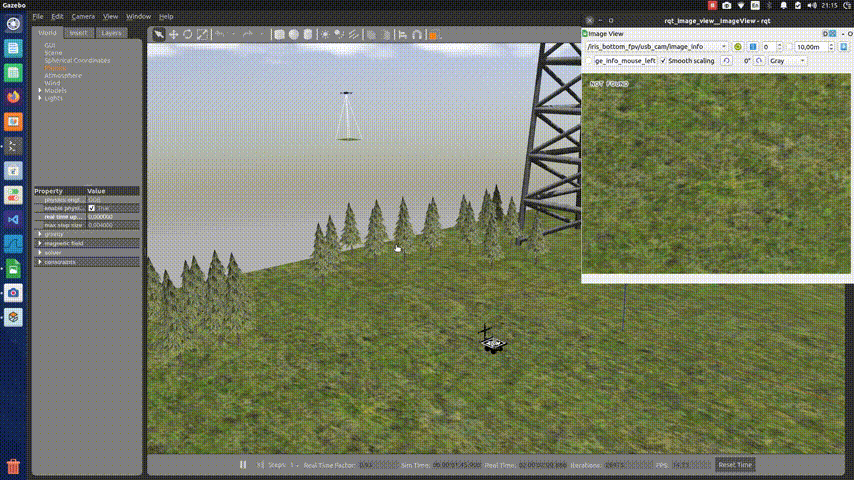

# Autonomous Landing Simulation for Multirotor UAVs

## Project Overview
This project involves the development of a simulation model for the autonomous landing of a multirotor unmanned aerial vehicle (UAV) on a moving landing platform. The simulation utilizes Aruco fractal marker pose estimation for precise landing. 

## Dependencies

1. PX4 Autopilot (v1.13.3)
2. Gazebo
3. ROS1
4. OpenCV
5. [Aruco Library](https://sourceforge.net/projects/aruco)

## Repository Structure

### Config

- `camera_calibration/` - Contains calibration files for the camera used in the simulation.
- `drone_fsm.yaml` - Configuration for the drone finite state machine.
- `landing_controller.yaml` - Configuration for the landing controller.
- `aruco_estimator.yaml` - Configuration for Aruco marker estimation.
- `ugv_control.yaml` - Configuration for the unmanned ground vehicle.

### Launch

- `drone_fsm.launch` - Launch file for the drone finite state machine.
- `landing_controller.launch` - Launch file for the landing controller.
- `aruco_estimator.launch` - Launch file for the Aruco marker estimator.
- `spawn_husky.launch` - Launch file for spawning the Husky model.
- `spawn_iris.launch` - Launch file for spawning the Iris model.
- `ugv_control.launch` - Launch file for UGV control.
- `uav_landing.launch` - Main launch file for the UAV landing simulation.

### Scripts

#### Drone

- `drone_fsm.py` - Script for the drone finite state machine.
- `landing_controller.py` - Script for the landing controller.

#### Positioning

- `aruco_estimator.py` - Script for Aruco marker estimation.

#### UGV

- `ugv_control.py` - Script for UGV control.

### Worlds

- `sim_windy_world/` - Gazebo world files for simulating windy conditions.
- `sim_world/` - General Gazebo world files.

## Simulation Details
The simulation employs the following technologies for accurate landing:

- **Aruco Fractal Marker Pose Estimation:** Utilizes Aruco fractal markers to determine the precise position and orientation of the landing platform.

# References
- [Bachelor thesis](https://elib.spbstu.ru/dl/3/2023/vr/vr23-3642.pdf/en/info)
- [Anikin Dmitry, et al. "Autonomous landing algorithm for UAV on a mobile robotic platform with a fractal marker." International Conference on Interactive Collaborative Robotics. Cham: Springer Nature Switzerland, 2023.](https://doi.org/10.1007/978-3-031-43111-1_32)
- [Ryabinov Artyom Valer'evich, Anton Igorevich Saveliev, and Dmitriy Andreevich Anikin. "Modeling the influence of external influences on the process of automated landing of a UAV-quadcopter on a moving platform using technical vision." Modelirovanie i Analiz Informatsionnykh Sistem 30.4 (2023): 366-381.](https://doi.org/10.18255/1818-1015-2023-4-366-381)